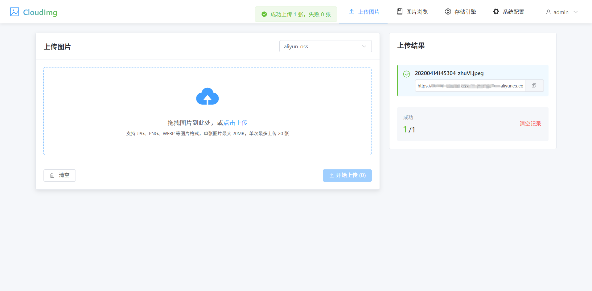
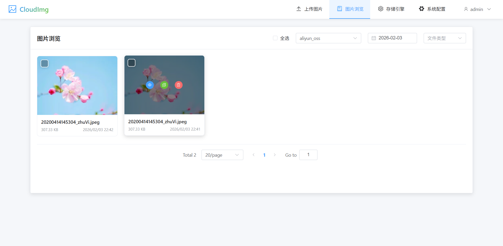
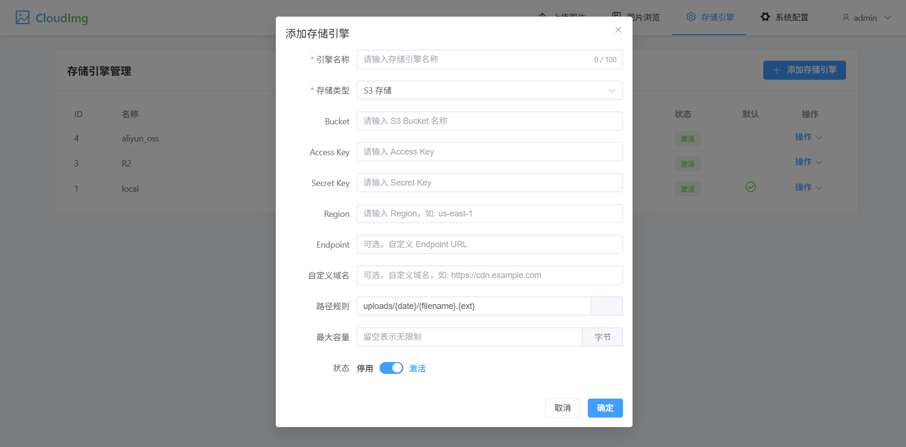
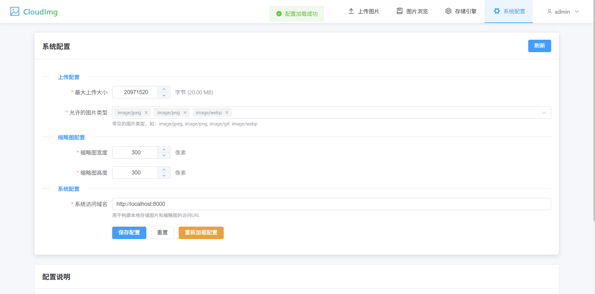

# CloudImg

Web 图床系统，支持多种云存储后端的图片上传与管理服务。

前端地址: https://github.com/cnnotnull/cloudimg-vue

**图片上传**

**浏览图片**

**存储引擎**

**系统配置**



## 功能特性

- 多存储引擎支持：本地存储、阿里云 OSS、AWS S3
- 自动缩略图生成
- 图片管理：上传、浏览、删除、搜索
- 存储引擎管理与容量监控
- RESTful API 设计
- 自动 API 文档 (Swagger/ReDoc)

## 技术栈

- Python 3.13+
- FastAPI
- SQLAlchemy + aiosqlite
- Alembic (数据库迁移)
- aioboto3 (AWS S3)
- alibabacloud-oss-v2 (阿里云 OSS)

## 快速开始

### 安装

```bash
# 安装依赖
uv sync

# 或使用 pip
pip install -e .
```

### 配置

复制 `.env.example` 到 `.env` 并修改配置：

```bash
cp .env.example .env
```

主要配置项：
- `DATABASE_URL`: 数据库连接
- `SECRET_KEY`: 安全密钥
- `ADMIN_USERNAME` / `ADMIN_PASSWORD`: 管理员账号

### 数据库迁移

```bash
# 初始化数据库
alembic upgrade head
```

### 运行

```bash
# 启动服务
uv run uvicorn app.main:app --reload

# 访问 API 文档
open http://localhost:8000/docs
```

## 项目结构

```
cloudimg/
├── app/
│   ├── api/          # API 路由
│   ├── core/         # 核心模块（存储引擎、缓存等）
│   ├── models/       # 数据模型
│   ├── schemas/      # Pydantic 模型
│   ├── services/     # 业务逻辑
│   └── utils/        # 工具函数
├── db/               # 数据库文件
├── uploads/          # 上传文件目录
├── thumbnails/       # 缩略图目录
└── migrations/       # 数据库迁移文件
```

## API 端点

| 功能 | 端点 |
|------|------|
| 图片上传 | `POST /api/v1/images/upload` |
| 图片列表 | `GET /api/v1/images` |
| 删除图片 | `DELETE /api/v1/images/{id}` |
| 存储引擎 | `GET /api/v1/storages` |
| 系统配置 | `GET /api/v1/config` |

## License

MIT
